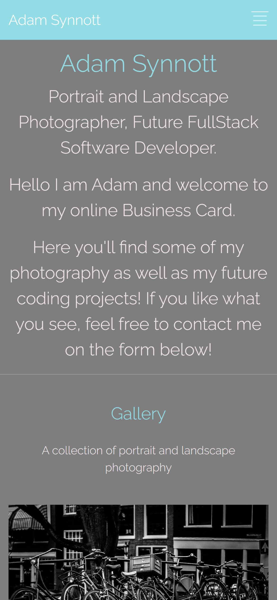
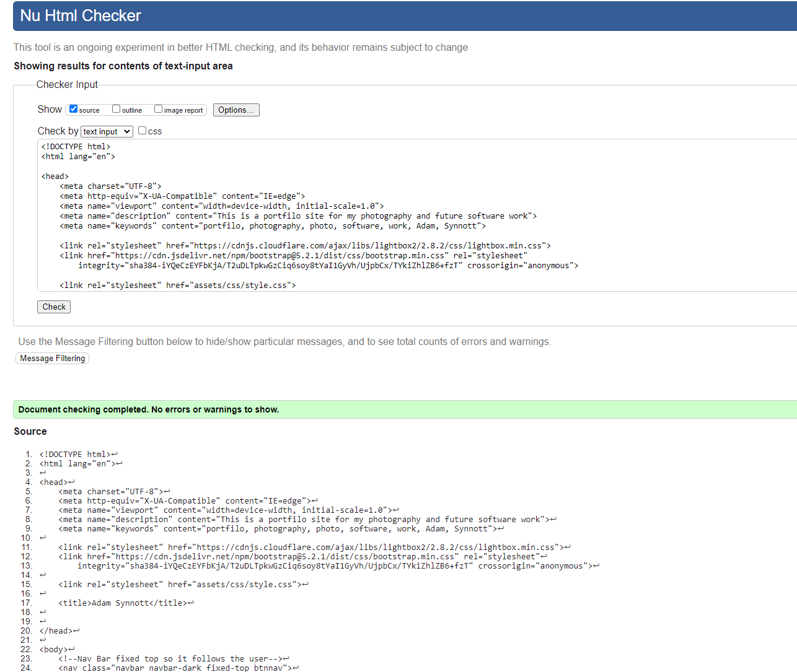
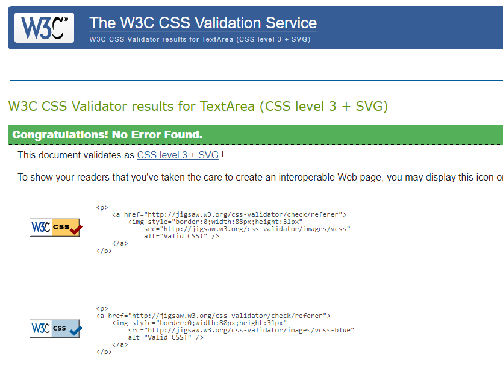

<h1 align="center">P1 - Portfolio Site For AdamSynnott.com</h1>

[View the live project here.](https://synnott3.github.io/P1_PortfolioSite/)

This will be the foundation of a future portfilo site that I will be using to host and display future coding projects, along side passed photography work, in this example and for P1 it will be just the photography work, using HTML, CSS as well as some JavaScript libraries. 

This will be a one page site, with a fixed colour palette throughout the site, that using bootstrape framework it will be fully reactive on all screen szies and devices.

 

## User Experience (UX)

### User Stories 

#### First Time Visitor Goals 

- It would be set up so that potential employers could see my work at a glance.
- It would become a show case of my best work, and not just a backlog of work.
- A place where I could have an online presence that any user may be able to view my work.
- Also for first time vistors it would become a testimonial of my work as well as proof of my ability.
- Become an online business card for contact and bookings with pass or future clients.

#### Returning Visitor Goals 

- For employers to see that I have kept up my work and skills that have improved over the years.
- For a followering of people who may enjoy my photography as well as my future coding work a place for them to see how my work has changede and evolved over the years.
- A place for passed clients to be able to contact me for future work.
- A hub of communications for on going work.

#### Frequent User Goals 
- Frequent users goals with this site would mainly be a place for clients to be able to come by for more work in the future, or updates on current work.
- To see how my skills and projects are working both finished and ongoing.
- If in a job hiring stage it may be a good point of references that may put me ahead of other hirers also going for the same job.

## Design

### Colour Scheme 
- There will be four many colours used throughout the site I have picked these based on a simple colour flow that has a slight pop to draw attention to important factors of the site e.g Nav Bar and contact page. (See screenshot below of colours used)

 

 - The whole site will also only be a single page site, with a simple title at the top followed by my work, which will be clickable using JS Lightbox (will go into more details in the technologies used section) and finally with a contact form at the bottom.

### Typography
- There will be one front throughout the site and that will be the google railroad font at 300 weight so very light and easy on the eyes for phone disply but won't take away from the gallery which is the main focus. 

 ### Imagery 
 - All imagery used will be of my own work. 
 - It is set up in such a way that images and work can be added very easily in time and always kept up to date.
 
## Wireframe 

See below for wireframe layout of site using Balsmiq, with a mobile first design as well as desktop layout. 

# Feature
- Responsive on all device sizes
- interative elements, such as pressing on an image will blow it up to a bigger more  detailed size for viewing.
- A working form page which moved you to a page showing your message and that it has been filled out  correctly.
- [Screen Recording of site on Mobile](https://drive.google.com/file/d/1w7FzXGyrSgtTRF84SZCdOZxC7SLZY_Qr/view?usp=sharing)
- So that you can see all thea features with the images. 

# Technologies Used

## Languages Used
- HTML 5
- CSS 
- JavaScript 

## FrameWorks and Libraries 
- [BootStrap 5.2](https://getbootstrap.com/)
This was used for a responsive  framework as well as buttons and features build in and styling aspects.
- [Google Fonts](https://fonts.google.com/specimen/Raleway?query=Raleway)
I used the above google font in my site for a simple flow that was easy to read but wouldn't take away from the work.
- JQuery - This was used within bootstrap for the navbar and some elements.
- [Git](https://github.com/Synnott3/P1_PortfolioSite)
Git was used for version control and utilized within in Gitpod to commit and push to Github
- [Github](https://github.com/Synnott3/P1_PortfolioSite)
Github was used to store my projects code after being pushed from git.
- [GitPages](https://synnott3.github.io/P1_PortfolioSite/)
This was used to host my site so it could be viewed in a URL.
- [JavaScirpt Lightbox](https://epicbootstrap.com/snippets/lightbox-gallery)
This was used to help the images pop and be stored in a neat gallery for future updates.
- [Balsamiq](https://balsamiq.com/)
This was used to create the wireframe for the project before coding.

# Testing
- [Screen Recording of site on Mobile](https://drive.google.com/file/d/1w7FzXGyrSgtTRF84SZCdOZxC7SLZY_Qr/view?usp=sharing)
This is a screen recording of the site working on an Iphone XR
- [HTML Validation](https://validator.w3.org/#validate_by_input) See results below.

- [CSS Validation](https://jigsaw.w3.org/css-validator/) See results below.

## Testing User Stories from User Experience (UX) Section

### First Time Visitor
- As the site was build with mobile first deisgn in mind to become a modern business card makes it easy to show new clients my work.
- A simple site that has everything set out for ease of access and use.
- The images are on disply so that you can see everything at once and it is interative.
- The navbar fixed will allow ease of navigation to move between the site as I add more work it will be easier to know where you are.
- Completes its task as an online business card with live work.
- The whole real ideal of this site was to create an online presence a digital busines card, by adding an introduction that then goes down into my work and followed 
by a contact form I believe that is what I have achieved. 
- It's better than a CV for showing protenial employers my skills.

### Returning Goals
- Being it will always be a place of my work a testimony of my style and projects for passed clients.
- This site would be always updated with my lastest work.
- Able to be contact myself on the site easly by the end user.
- Returning vistors will be aware of the new work as it will be top of the page and oldest at the bottom.

### Frequent User Goals
- Returning clients can see my work as well as work I've completed by them and be able to add Testimonials
- Able to share work with other photograpers/developers 
- For them to see new works/styles I'll be doing and trying.
- Having that online business card aspect to it will make it easy to quickly come back at anytime.
- Also to be used for anny future jobs seeking, as this will be a lot more impressive than a CV and can also be reflected on during the hiring process.  
- The friends I had testing the site found themsevles going through all the photos I had uploaded a this time, and would be willing to come back and check more when they are
added, This could be done by using socail media to let people know you've upaded your site.

# Futher Testing
- The Website was tested on Google Chrome, Microsoft Edge and Safari browsers.
- This Website was also viewed on many devices such as desktops, laptops Iphones and Andriods.
- Screen recording done on IphoneXR
- Friends asked to review the site and test it and report back any bugs found.
- More testing has been done to resolve any bugs found as well as to address any reading problems due to colour of the fonts.

# Known Bug
- Only known bug at the time of testing, is the form validation and also inbox the question is sent to. - Will be fixed.
- Update this bug was fixed and will dispaly the code institute submission page when the form is completed. 

# Deploment
## GitHub Pages
The project was deployed on Github pages - Follow the steps below.
- Log into Github and find the correct Repository
- At the top of the Reponistory not the top of the github site page, loacte the "settings" button in the menu section.
- Click the Setting button and scroll down the page untill you find "Code and Automation" on the right hand side. 
- In that section you should see a "Pages" section just at the very bottom.
- Click into the Pages section and you should be brought to a "Github Pages" area.
- Scrolling down you'll see a "Build and deployment section of the page.
- There will be a "Source" area which has the drop down menu with two options "Github Actions' and "Deploy from a branch"
- Click "Deploy from a branch" and that will bring up your brach "main" slect "main"
- That will then bring up your root file select that file and hit save.
- Wait a few minutes (Up to 10) for the live link of your site to appear at the top of the Github Pages section just under the main heading,
- It will say "your site is now live!" with a shareable link to the site.

# Credits 
- [BootStrap 5.2](https://getbootstrap.com/) This was used for the framework
- [BootStrap Youtube Tut](https://www.youtube.com/watch?v=Jyvffr3aCp0&ab_channel=WebDevSimplified) This video was used to understand bootstrap
and  for setting up the code and helping with any problems I may have.
- [LightBox Js](https://epicbootstrap.com/snippets/lightbox-gallery)
This was used for the gallery section of the site.

# Media 
- All images are mine.

# Achknowledgements 
- Code Institute for support during the progress.
- Mentors continous feedback.
- StackOverflow for many questions and answers.

