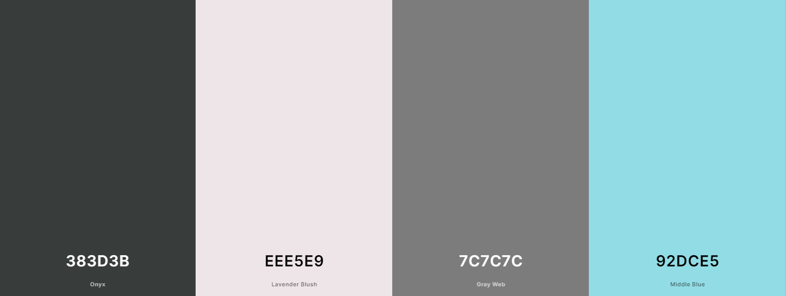
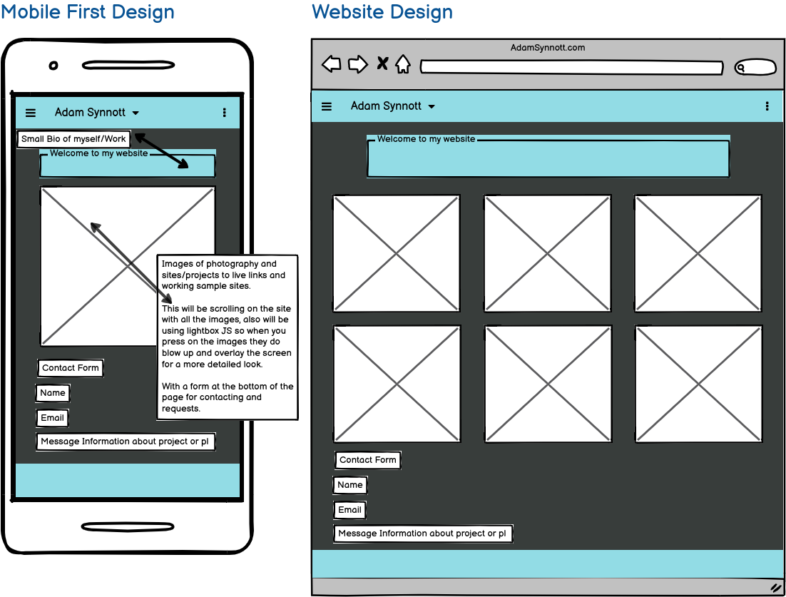

<h1 align="center">P1 - Portolio Site For AdamSynnott.com</h1>

[View the live project here.](https://synnott3.github.io/P1_PortfolioSite/)

This will be the foundation of a future portfilo site that I will be using to host and display future coding projects, along side passed photography work, in this example and for P1 it will be just the photography work, using HTML, CSS as well as some JavaScript libraries. 

This will be a one page site, with a fixed colour palette throughout the site, that using bootstrape framework it will be fully reactive on all screen szies and devices.

## User Experience (UX)

### User Stories 

#### First Time Visitor Goals 

- It would be set up so that potential employers could see my work at a glance.
- It would become a show case of my best work, and not just a backlog of work.
- A place where I could have an online presence that any user may be able to view my work.
- Also for first time vistors it would become a testimonial of my work as well as proof of my ability.
- Become an online business card for contact and bookings with pass or future clients.

#### Returning Visitor Goals 

- For employers to see that I have kept up my work and skills that have improved over the years.
- For a followering of people who may enjoy my photography as well as my future coding work a place for them to see how my work has changede and evolved over the years.
- A place for passed clients to be able to contact me for future work.
- A hub of communications for on going work.

#### Frequent User Goals 
- Frequent users goals with this site would mainly be a place for clients to be able to come by for more work in the future, or updates on current work.
- To see how my skills and projects are working both finished and ongoing.
- If in a job hiring stage it may be a good point of references that may put me ahead of other hirers also going for the same job.

## Design

### Colour Scheme 
- There will be four many colours used throughout the site I have picked these based on a simple colour flow that has a slight pop to draw attention to important factors of the site e.g Nav Bar and contact page. (See screenshot below of colours used)

 

 - The whole site will also only be a single page site, with a simple title at the top followed by my work, which will be clickable using JS Lightbox (will go into more details in the technologies used section) and finally with a contact form at the bottom.

### Typography
- There will be one front throughout the site and that will be the google railroad font at 300 weight so very light and easy on the eyes for phone disply but won't take away from the gallery which is the main focus. 

 ### Imagery 
 - All imagery used will be of my own work. 
 - It is set up in such a way that images and work can be added very easily in time and always kept up to date.
 
## Wireframe 

See below for wireframe layout of site using Balsmiq, with a mobile first design as well as desktop layout. 

# Feature
- Responsive on all device sizes
- interative elements, such as pressing on an image will blow it up to a bigger more  detailed size for viewing.
- Soon to be working for form page for contact.

# Technologies Used

## Languages Used
- HTML 5
- CSS 
- JavaScript 

## FrameWorks and Libraries 
- [BootStrap 5.2](https://getbootstrap.com/)
This was used for a responsive  framework as well as buttons and features build in and styling aspects.
- [Google Fonts](https://fonts.google.com/specimen/Raleway?query=Raleway)
I used the above google font in my site for a simple flow that was easy to read but wouldn't take away from the work.
- JQuery - This was used within bootstrap for the navbar and some elements.
- [Git](https://github.com/Synnott3/P1_PortfolioSite)
Git was used for version control and utilized within in Gitpod to commit and push to Github
- [Github](https://github.com/Synnott3/P1_PortfolioSite)
Github was used to store my projects code after being pushed from git.
- [GitPages](https://synnott3.github.io/P1_PortfolioSite/)
This was used to host my site so it could be viewed in a URL.
- [JavaScirpt Lightbox](https://epicbootstrap.com/snippets/lightbox-gallery)
This was used to help the images pop and be stored in a neat gallery for future updates.
- [Balsamiq](https://balsamiq.com/)
This was used to create the wireframe for the project before coding.

# Testing
- [Screen Recording of site](https://drive.google.com/file/d/1xyVGVHQOuCLOxWIhDNSV6z6fyPLIuSYq/view?usp=sharing)
This is a screen recording of the site working on an Iphone XR

## Testing User Stories from User Experience (UX) Section

### First Time Visitor
- A simple site that has everything set out for ease of access and use.
- The images are on disply so that you can see everything at once and it is interative.
- The navbar fixed will allow ease of navigation to move between the site as I add more work it will be easier to know where you are.
- Completes its task as an online business card with live work.

### Returning Goals
- This site would be always updated with my lastest work.
- Able to be contacted on the site easly by the end user.
- Returning vistors will be aware of the new work as it will be top of the page and oldest at the bottom.

### Frequent User Goals
- Returning clients can see my work as well as work I've completed by them and be able to add Testimonials
- Able to share work with other photograpers/developers 
- For them to see new works/styles I'll be doing and trying.

# Futher Testing
- The Website was tested on Google Chrome, Internet Explorer, Microsoft Edge and Safari browsers.
- This Website was also viewed on many devices such as desktops, laptops Iphones and Andriods.
- Screen recording done on IphoneXR
- Friends asked to review the site and test it and report back any bugs found.

# Known Bug
- Only known bug at the time of testing, is the form validation and also inbox the question is sent to. - Will be fixed.

# Deploment
## GitHub Pages
The project was deployed on Github pages - Follow the steps below.
- Log into Github and find the correct Repository
- Go to settings and look for the Code and automation section on the right hand side..
- Go to the Pages section 
- Click onto it and look for Build and deployment
- Head to Branch - point it to main and click Save
- It will take up to 10 minutes for the site to go live, and a link will show in the Pages section.

# Credits 
- [BootStrap 5.2](https://getbootstrap.com/) This was used for the framework
- [BootStrap Youtube Tut](https://www.youtube.com/watch?v=Jyvffr3aCp0&ab_channel=WebDevSimplified) This video was used to understand bootstrap
and  for setting up the code and helping with any problems I may have.
- [LightBox Js](https://epicbootstrap.com/snippets/lightbox-gallery)
This was used for the gallery section of the site.

# Media 
- All images are mine.

# Achknowledgements 
- Code Institute for support during the progress.
- Mentors continous feedback.

